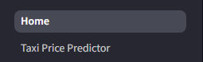
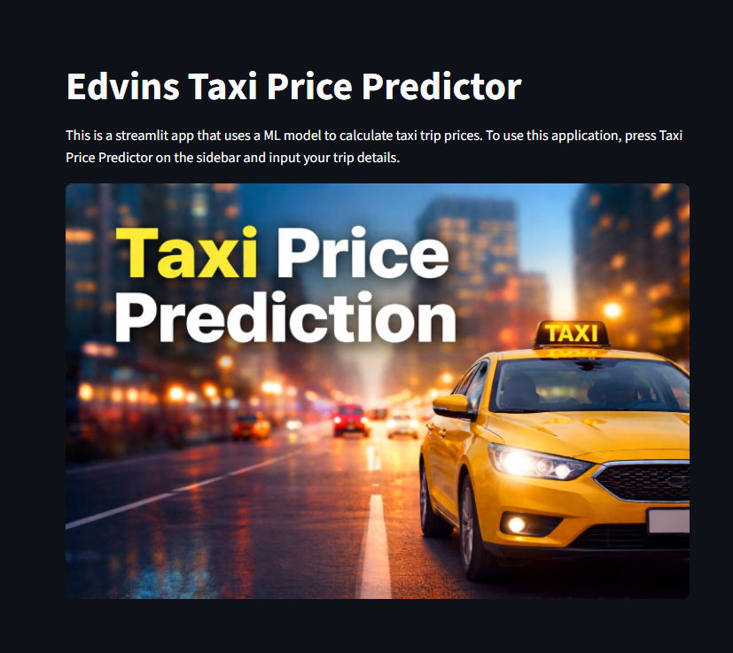
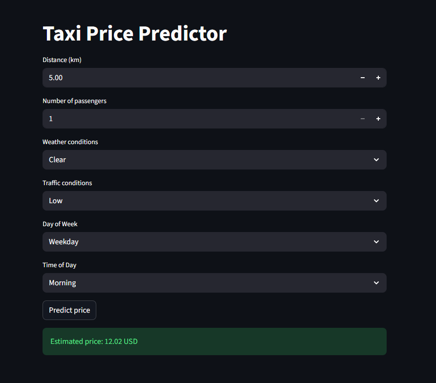

# taxi_prediction_fullstack_edvin
Fullstack ML application for predicting taxi prices

# EDA and Data Cleaning

I started with accessing the data, I didn't find any outliers and figured out how to deal with null values.
I cleaned null values with imputation by calculating with the help of other known values where possible,
the other null values were dropped.

# Model Development

I trained a Linear Regression model and a Random Forest Model on the cleaned data and selected the Random Forest model due to its lower RMSE.

# Backend and Frontend

I have a simple homepage that explains how to use the application and a prediction page where the taxi price prediction happens.
Streamlit connects to the backend where user input gets put into build model input which then gets forwarded to the ML model that then returns a result and posts it through the /predict api endpoint which then gets shown to the user.